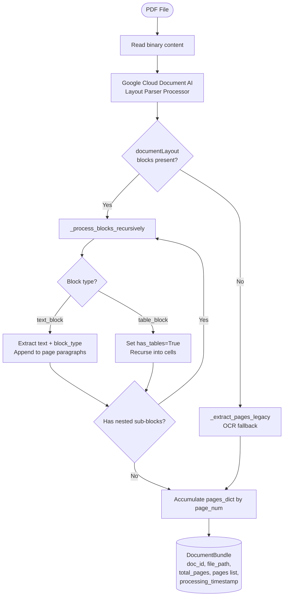

# Document Processor — Code-Verified Process Reference

**File:** `src/document_processor.py`
**Class:** `DocumentProcessor`
**Purpose:** Convert a raw PDF file into a structured `DocumentBundle` using Google Cloud Document AI (Layout Parser).

---

## What It Does — Step by Step

### Step 1: Initialise Document AI Client
```python
# src/document_processor.py  Lines 15–27
opts = ClientOptions(api_endpoint=f"{settings.document_ai_location}-documentai.googleapis.com")
self.client = documentai.DocumentProcessorServiceClient(client_options=opts)
self.processor_name = self.client.processor_path(
    settings.gcp_project_id,
    settings.document_ai_location,
    settings.document_ai_processor_id
)
```
- Reads `gcp_project_id`, `document_ai_location`, `document_ai_processor_id` from `config.py` / `.env`
- Constructs the fully-qualified processor resource path

---

### Step 2: Read PDF and Send to Document AI
```python
# Lines 40–55
with open(pdf_path, 'rb') as file:
    pdf_content = file.read()
raw_document = documentai.RawDocument(content=pdf_content, mime_type='application/pdf')
request = documentai.ProcessRequest(name=self.processor_name, raw_document=raw_document)
result = self.client.process_document(request=request)
document = result.document
```
- Reads the entire PDF as binary
- Wraps it in a `RawDocument` with MIME type `application/pdf`
- Sends a synchronous `ProcessRequest` to the Layout Parser processor
- Returns a `Document` object with `document_layout.blocks` and `pages`

---

### Step 3: Extract Pages — `_extract_pages()`
```python
# Lines 77–110
```
**Decision logic:**
1. If `document.document_layout.blocks` exists → call `_process_blocks_recursively()` (Layout Parser path)
2. If no blocks extracted → fall back to `_extract_pages_legacy()` (OCR Processor path)

Each page entry in the output list contains:
| Field | Description |
|---|---|
| `page_num` | 1-indexed page number |
| `text` | Full concatenated text for the page |
| `paragraphs` | List of individual paragraph strings |
| `layout_metadata` | `{block_types: [...], has_tables: bool}` |

---

### Step 4: Recursive Block Processing — `_process_blocks_recursively()`
```python
# Lines 112–172
```
Iterates over every block in `document_layout.blocks`:

| Block Type | Action |
|---|---|
| `text_block` | Extract `.text` and `.type` (heading/paragraph). Append to `pages_dict[page_num]['paragraphs']`. Recurse into nested `.blocks` |
| `table_block` | Set `has_tables=True`. Recurse into `body_rows → cells → blocks` to extract cell text |

- Page number is read from `block.page_span.page_start` (defaults to 1 if missing)
- Pages are accumulated in a dict keyed by `page_num`, then sorted into a list

---

### Step 5: Legacy OCR Fallback — `_extract_pages_legacy()`
```python
# Lines 174–206
```
Used when the Layout Parser `document_layout` is empty. Reads from `document.pages`:
- Calls `_get_page_text()` → `_get_layout_text()` to extract text via `text_anchor.text_segments` byte offsets
- Extracts `page.paragraphs` list
- Records `has_tables`, `paragraph_count`, `line_count` in `layout_metadata`

---

### Step 6: Build DocumentBundle
```python
# Lines 66–74
doc_id = os.path.splitext(os.path.basename(pdf_path))[0]
bundle = DocumentBundle(
    doc_id=doc_id,
    file_path=pdf_path,
    total_pages=len(pages),
    pages=pages,
    processing_timestamp=datetime.utcnow().isoformat()
)
```

**`DocumentBundle` schema** (`src/schemas.py` Lines 114–120):
| Field | Type | Description |
|---|---|---|
| `doc_id` | `str` | PDF filename without extension |
| `file_path` | `str` | Absolute path to PDF |
| `total_pages` | `int` | Number of pages extracted |
| `pages` | `List[dict]` | Page dicts with text, paragraphs, layout_metadata |
| `processing_timestamp` | `str` | UTC ISO timestamp |

---

### Step 7: Format for LLM — `format_for_llm()`
```python
# Lines 228–242
```
Converts `DocumentBundle` into a plain-text string with page markers:
```
Document ID: doc2_6
Total Pages: 8

--- PAGE 1 ---
[page text]

--- PAGE 2 ---
...
```
Used by the Primary Classifier Agent to feed the document content into the Gemini LLM prompt.

---

## Mermaid Diagram


