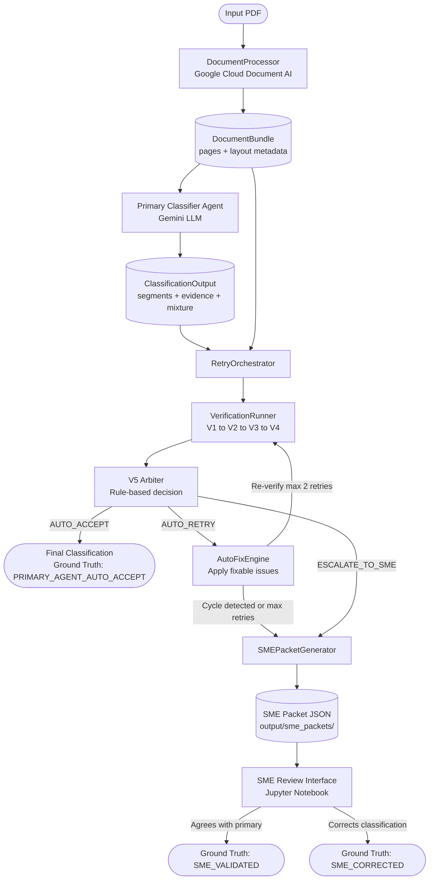

# End-to-End Pipeline — Code-Verified Process Reference

**Files:** `src/agents/verification_runner.py`, `src/agents/retry_orchestrator.py`, `src/agents/output_saver.py`, `src/schemas.py`
**Purpose:** Orchestrate the full journey from PDF ingestion to a final ground truth classification.

---

## What It Does — Step by Step

### Step 1: PDF Ingestion → DocumentBundle
- `DocumentProcessor.process_pdf(pdf_path)` is called
- Google Cloud Document AI (Layout Parser) processes the PDF
- Returns a `DocumentBundle` with `doc_id`, `total_pages`, and a `pages` list (each page has `text`, `paragraphs`, `layout_metadata`)

---

### Step 2: Primary Classification
- `PrimaryClassifierAgent` receives the `DocumentBundle`
- `format_for_llm()` converts it to a page-marked text string
- Gemini LLM is called with the classification prompt
- Returns a `ClassificationOutput` containing:
  - `dominant_type_overall` — single dominant document type
  - `segments` — list of page-range segments, each with `segment_composition` (all 5 doc types with presence, confidence, share, evidence)
  - `document_mixture` — overall doc type breakdown
  - `vendor_signals` — detected vendor names
  - `number_of_segments`
  - `self_evaluation` — LLM's own assessment

---

### Step 3: RetryOrchestrator Entry
```python
# src/agents/retry_orchestrator.py  Lines 32–133
RetryOrchestrator.verify_with_retry(classification, doc_bundle)
```
- Initialises `attempt=0`, `seen_fingerprints=set()`
- Enters a loop (max `MAX_RETRIES=2` + 1 = 3 total attempts)

---

### Step 4: VerificationRunner — Run V1 → V4 Agents
```python
# src/agents/verification_runner.py  Lines 43–134
VerificationRunner.run_all(classification, doc_bundle)
```
Agents run **sequentially** in this order:

| Order | Agent | Type | Output |
|---|---|---|---|
| 1 | V1 SchemaValidator | Rule-based | `List[Issue]` |
| 2 | V2 ConsistencyChecker | Hybrid (rules + LLM) | `List[Issue]` + `consistency_score` |
| 3 | V3 TrapDetector | Hybrid (patterns + LLM) | `List[Issue]` + `traps_triggered` |
| 4 | V4 EvidenceQualityAssessor | Full LLM | `List[Issue]` + `evidence_score` |

After each agent, `AgentOutputSaver` writes results to `output/agent_outputs/{doc_id}/`:
- `primary_classification.json`
- `v1_schema_validation.json`
- `v2_consistency_check.json`
- `v3_trap_detection.json`
- `v4_evidence_quality.json`

---

### Step 5: Build VerificationReport
```python
# Lines 111–120
report = VerificationReport(
    issues=all_issues,
    v1_validation_passed=...,
    v2_consistency_score=...,
    v3_traps_triggered=...,
    v4_evidence_quality_score=...,
    has_blocker_issues=...,
    total_issues=...,
    llm_calls_made=...
)
```

---

### Step 6: V5 Arbiter Decision
```python
# Lines 122–128
arbiter_decision = self.v5.decide(report)
```
Returns one of three decisions:
- `AUTO_ACCEPT` — no or only minor issues
- `AUTO_RETRY` — 1–2 fixable major issues
- `ESCALATE_TO_SME` — any blocker or non-fixable major issues

Saved to `output/agent_outputs/{doc_id}/v5_arbiter_decision.json`

---

### Step 7: Cycle Detection
```python
# Lines 68–80
fingerprint = self._get_classification_fingerprint(current_classification)
if fingerprint in seen_fingerprints:
    → override to ESCALATE_TO_SME
```
MD5 hash of: segment boundaries, dominant types, share distributions.

---

### Step 8: AUTO_RETRY Branch — AutoFixEngine
```python
# Lines 105–128
fixable_issues = [i for i in report.issues if i.auto_fixable]
current_classification, fixes_applied = self.fix_engine.apply_fixes(current_classification, fixable_issues)
```
- Applies share normalisation fixes
- Logs retry entry: attempt number, issues before fix, fixes applied
- Loops back to Step 4 (re-verify)

---

### Step 9: ESCALATE_TO_SME Branch — SME Packet
- `SMEPacketGenerator.generate_packet()` is called
- Saves `output/sme_packets/sme_packet_{doc_id}.json`
- SME reviews via Jupyter notebook interface

---

### Step 10: Ground Truth Creation
| Path | Ground Truth Source |
|---|---|
| `AUTO_ACCEPT` | `PRIMARY_AGENT_AUTO_ACCEPT` |
| SME agrees | `SME_VALIDATED` |
| SME corrects | `SME_CORRECTED` |

Saved to `output/ground_truth/gt_{doc_id}.json`

---

## Mermaid Diagram


