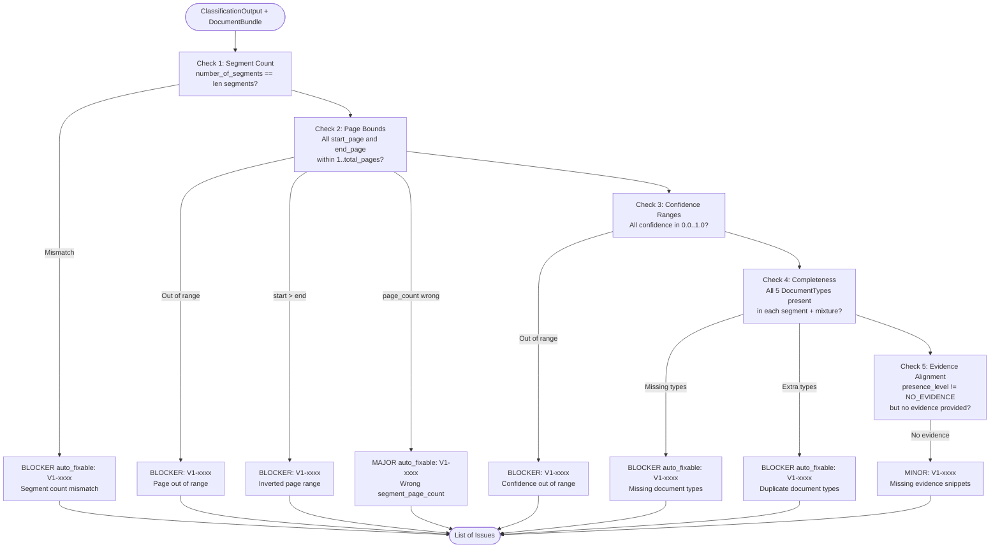

# V1 Schema & Completeness Validator — Code-Verified Process Reference

**File:** `src/agents/v1_schema_validator.py`
**Class:** `V1SchemaValidator`
**Type:** Pure rule-based — no LLM calls, zero API cost
**Purpose:** Validate the structural correctness and completeness of the `ClassificationOutput` schema.

---

## What It Does — Step by Step

### Entry Point
```python
# Lines 20–57
def validate(self, classification: ClassificationOutput, doc_bundle: DocumentBundle) -> List[Issue]:
```
Runs 5 checks in sequence. Each check returns a list of `Issue` objects. All issues are aggregated and returned.

---

### Check 1: Segment Count — `_check_segment_count()`
```python
# Lines 59–82
expected = classification.number_of_segments
actual = len(classification.segments)
if expected != actual:
    → BLOCKER Issue (V1-xxxx)
    message: "number_of_segments is {expected} but segments array has {actual} items"
    auto_fixable: True
    ig_id: "IG-1"
```
**What it checks:** The declared `number_of_segments` integer must exactly match the length of the `segments` array.

---

### Check 2: Page Bounds — `_check_page_bounds()`
```python
# Lines 84–148
max_page = doc_bundle.total_pages
for segment in classification.segments:
```
Runs **4 sub-checks** per segment:

| Sub-check | Condition | Severity | Auto-fixable |
|---|---|---|---|
| start_page in range | `start_page < 1` or `start_page > max_page` | BLOCKER | No |
| end_page in range | `end_page < 1` or `end_page > max_page` | BLOCKER | No |
| start ≤ end | `start_page > end_page` | BLOCKER | No |
| page count correct | `segment_page_count != end_page - start_page + 1` | MAJOR | **Yes** |

Issue IDs: `V1-0000`, `V1-0001`, etc. (sequential counter)
IG codes: `IG-1` (range errors), `IG-6` (inverted range)

---

### Check 3: Confidence Ranges — `_check_confidence_ranges()`
```python
# Lines 150–191
for segment in classification.segments:
    for comp in segment.segment_composition:
        if not (0.0 <= comp.confidence <= 1.0):
            → BLOCKER Issue (V1-xxxx), ig_id="IG-1"

for mix in classification.document_mixture:
    if not (0.0 <= mix.confidence <= 1.0):
        → BLOCKER Issue (V1-xxxx), ig_id="IG-1"
```
**What it checks:** Every `confidence` value in every `SegmentComposition` and every `DocumentMixture` entry must be in `[0.0, 1.0]`.

---

### Check 4: Completeness — `_check_completeness()`
```python
# Lines 193–265
all_types = set(DocumentType)
# DocumentType has 5 values:
# Clinical Note, Pathology Report, Genomic Report, Radiology Report, Other
```
Runs **2 sub-checks**:

**4a. Per-segment completeness:**
```python
for segment in classification.segments:
    types_in_segment = {comp.document_type for comp in segment.segment_composition}
    missing_types = all_types - types_in_segment  → BLOCKER, auto_fixable=True, ig_id="IG-7"
    extra_types = types_in_segment - all_types    → BLOCKER, auto_fixable=True, ig_id="IG-7"
```

**4b. Document mixture completeness:**
```python
types_in_mixture = {mix.document_type for mix in classification.document_mixture}
missing_types → BLOCKER, auto_fixable=True, ig_id="IG-7"
extra_types   → BLOCKER, auto_fixable=True, ig_id="IG-7"
```
**What it checks:** All 5 `DocumentType` enum values must appear exactly once in each segment's `segment_composition` and in the top-level `document_mixture`.

---

### Check 5: Evidence Alignment — `_check_evidence_alignment()`
```python
# Lines 268–297
for segment in classification.segments:
    for comp in segment.segment_composition:
        if comp.presence_level != PresenceLevel.NO_EVIDENCE:
            if not comp.top_evidence or len(comp.top_evidence) == 0:
                → MINOR Issue (V1-xxxx), ig_id="IG-5", auto_fixable=False
```
**What it checks:** If a document type is classified as `PRIMARY`, `EMBEDDED_RAW`, or `MENTION_ONLY` (i.e., not `NO_EVIDENCE`), it should have at least one evidence snippet in `top_evidence`. Missing evidence is flagged as MINOR (not a blocker — low-presence types may legitimately have no snippet).

---

## Issue Severity Summary

| Check | Severity | Auto-fixable | IG Code |
|---|---|---|---|
| Segment count mismatch | BLOCKER | Yes | IG-1 |
| Page out of bounds | BLOCKER | No | IG-1 |
| Inverted page range | BLOCKER | No | IG-6 |
| Wrong page count | MAJOR | Yes | IG-1 |
| Confidence out of range | BLOCKER | No | IG-1 |
| Missing document types | BLOCKER | Yes | IG-7 |
| Duplicate document types | BLOCKER | Yes | IG-7 |
| No evidence for non-NO_EVIDENCE | MINOR | No | IG-5 |

---

## Mermaid Diagram


