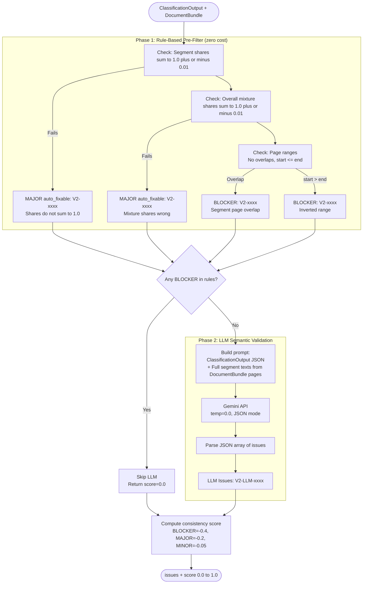

# V2 Internal Consistency Checker — Code-Verified Process Reference

**File:** `src/agents/v2_consistency_checker.py`
**Class:** `V2ConsistencyChecker`
**Type:** Hybrid — rule-based pre-filter + LLM semantic validation
**Prompt:** `Prompts/V2_Internal_Consistency_Auditor.txt`
**Purpose:** Validate mathematical and semantic consistency of the `ClassificationOutput`.

---

## What It Does — Step by Step

### Entry Point
```python
# Lines 37–74
def validate(self, classification: ClassificationOutput, doc_bundle: DocumentBundle) -> Tuple[List[Issue], float]:
```
Returns `(issues, consistency_score)` where score is `0.0–1.0`.

---

## Phase 1: Rule-Based Pre-Filter — `_run_rule_checks()`
```python
# Lines 76–144
```
Fast, zero-cost checks run before any LLM call. If any BLOCKER is found here, the LLM phase is **skipped entirely** and score is returned as `0.0`.

### Rule Check 1: Segment Shares Sum to 1.0
```python
SHARE_TOLERANCE = 0.01
for seg in classification.segments:
    total = sum(comp.segment_share for comp in seg.segment_composition)
    if not (1.0 - SHARE_TOLERANCE <= total <= 1.0 + SHARE_TOLERANCE):
        → MAJOR Issue, ig_id="IG-8", auto_fixable=True
        message: "Segment {N} shares sum to {total:.3f} instead of 1.0"
```
**What it checks:** Within each segment, the 5 `segment_share` values must sum to exactly `1.0` (±0.01 tolerance).

### Rule Check 2: Overall Mixture Shares Sum to 1.0
```python
total_overall = sum(mix.overall_share for mix in classification.document_mixture)
if not (1.0 - SHARE_TOLERANCE <= total_overall <= 1.0 + SHARE_TOLERANCE):
    → MAJOR Issue, ig_id="IG-8", auto_fixable=True
    message: "Document mixture overall_share sums to {total_overall:.3f} instead of 1.0"
```
**What it checks:** The 5 `overall_share` values in `document_mixture` must sum to `1.0` (±0.01 tolerance).

### Rule Check 3: Page Range Validity
```python
segments = sorted(classification.segments, key=lambda s: s.start_page)
for i, seg in enumerate(segments):
    if seg.start_page > seg.end_page:
        → BLOCKER Issue, ig_id="IG-6"
    if seg.end_page >= next_seg.start_page:
        → BLOCKER Issue, ig_id="IG-6"
        message: "Segment {N} ends at {X}, overlaps with Segment {M} starting at {Y}"
```
**What it checks:** Segments must not overlap. Sorted by `start_page`, each segment's `end_page` must be strictly less than the next segment's `start_page`.

---

## Phase 2: LLM Semantic Validation — `_run_llm_check()`
```python
# Lines 146–240
```
Only runs if **no BLOCKER** was found in Phase 1.

### What the LLM receives:
1. **`classification_json`** — full `ClassificationOutput` as JSON
2. **`segment_texts_json`** — full text from `DocumentBundle` for every page in every segment:
```python
for seg in classification.segments:
    for page_num in range(seg.start_page, seg.end_page + 1):
        seg_text += f"--- PAGE {page_num} ---\n{doc_bundle.pages[page_num-1]['text']}\n"
```
> This uses the **full segment text** (not a truncated preview) for rigorous semantic validation.

### What the LLM is asked to do:
- Check semantic consistency between segment text and classification labels
- Detect contradictions (e.g., a segment labelled "Genomic Report" but containing only clinical notes)
- Flag presence level mismatches (e.g., `PRIMARY` assigned to a type barely mentioned)
- Return a JSON array of issues with `ig_id`, `issue_id`, `severity`, `location`, `message`, `suggested_fix`, `auto_fixable`

### LLM Call Parameters:
```python
model=settings.gemini_model
temperature=0.0
response_mime_type="application/json"
```

### Issue IDs: `V2-LLM-0001`, `V2-LLM-0002`, etc.

---

## Score Computation — `_compute_score()`
```python
# Lines 242–256
penalty = 0.0
for issue in issues:
    if BLOCKER: penalty += 0.4
    elif MAJOR: penalty += 0.2
    else:       penalty += 0.05
return max(0.0, 1.0 - penalty)
```
Score of `1.0` = no issues. Score decreases with each issue found.

---

## Issue Severity Summary

| Check | Severity | Auto-fixable | IG Code | Phase |
|---|---|---|---|---|
| Segment shares ≠ 1.0 | MAJOR | Yes | IG-8 | Rule |
| Mixture shares ≠ 1.0 | MAJOR | Yes | IG-8 | Rule |
| Segment page overlap | BLOCKER | No | IG-6 | Rule |
| Inverted page range | BLOCKER | No | IG-6 | Rule |
| Semantic inconsistency | MAJOR/MINOR | Varies | IG-9 | LLM |

---

## Mermaid Diagram


