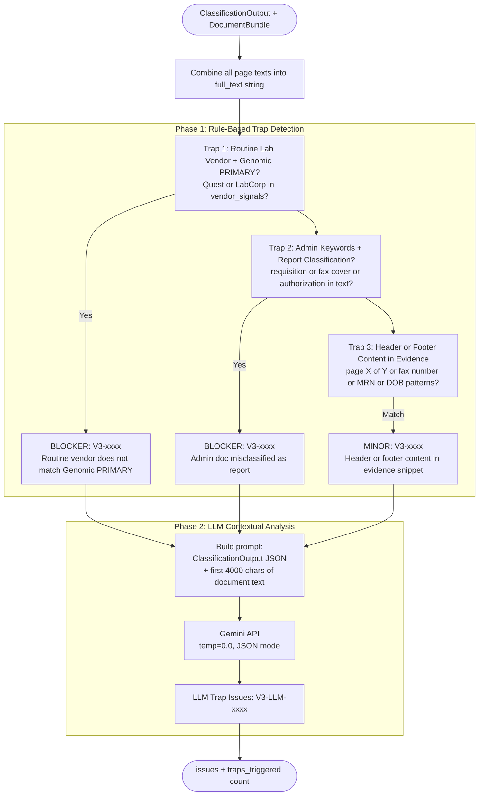

# V3 Trap Detector & Rule Violation Checker — Code-Verified Process Reference

**File:** `src/agents/v3_trap_detector.py`
**Class:** `V3TrapDetector`
**Type:** Hybrid — pattern matching + LLM contextual analysis
**Prompt:** `Prompts/V3_Trap_Detector_and_Rule_Violation_Checker.txt`
**Purpose:** Detect domain-specific classification traps that rule-based checks cannot catch — e.g., routine lab results misclassified as genomic reports, or administrative documents labelled as clinical reports.

---

## What It Does — Step by Step

### Entry Point
```python
# Lines 40–69
def validate(self, classification: ClassificationOutput, doc_bundle: DocumentBundle) -> Tuple[List[Issue], int]:
```
Returns `(issues, traps_triggered_count)`.

### Pre-step: Build Full Text
```python
# Lines 71–73
full_text = "\n".join(page['text'] for page in doc_bundle.pages)
```
Concatenates all page texts from the `DocumentBundle` into a single string for pattern matching.

---

## Phase 1: Rule-Based Trap Detection — `_run_rule_traps()`
```python
# Lines 75–150
```

### Trap 1: Routine Lab Vendor + Genomic PRIMARY
```python
VENDOR_ROUTINE_LABS = ["quest", "labcorp", "lab corp"]

for mix in classification.document_mixture:
    if mix.document_type == DocumentType.GENOMIC_REPORT and mix.presence_level == PresenceLevel.PRIMARY:
        has_routine_vendor = any(
            vendor in vendor_sig.lower()
            for vendor in VENDOR_ROUTINE_LABS
            for vendor_sig in classification.vendor_signals
        )
        if has_routine_vendor:
            → BLOCKER Issue, ig_id="IG-5"
            message: "Routine lab vendor detected ({vendors}) but Genomic Report marked PRIMARY"
            suggested_fix: "Reclassify as 'Other' or downgrade to MENTION_ONLY"
```
**Why this matters:** Quest Diagnostics and LabCorp produce routine lab panels (CBC, metabolic panels), not genomic sequencing reports. If the LLM sees gene-like terminology in a routine lab and marks it as `Genomic Report PRIMARY`, this trap catches it.

---

### Trap 2: Administrative Keywords + Report Classification
```python
ADMIN_KEYWORDS = ["requisition", "authorization number", "fax cover", "test request", "specimen receipt"]

has_admin = any(keyword in full_text.lower() for keyword in ADMIN_KEYWORDS)
if has_admin:
    for mix in classification.document_mixture:
        if mix.document_type in [DocumentType.GENOMIC_REPORT, DocumentType.PATHOLOGY_REPORT]:
            if mix.presence_level != PresenceLevel.NO_EVIDENCE:
                → BLOCKER Issue, ig_id="IG-2"
                message: "Administrative keywords found but {doc_type} marked as {presence_level}"
                suggested_fix: "Reclassify as 'Other' (administrative document)"
```
**Why this matters:** Fax cover sheets, lab requisition forms, and specimen receipts contain medical terminology but are administrative documents — not clinical reports. The presence of keywords like "requisition" or "fax cover" is a strong signal the document is administrative.

---

### Trap 3: Header/Footer Content in Evidence Snippets
```python
header_footer_patterns = [
    r'page \d+ of \d+',
    r'fax.*?\d{3}[-.]?\d{3}[-.]?\d{4}',
    r'medical record number|mrn',
    r'date of birth.*?\d{2}/\d{2}/\d{4}'
]

for seg in classification.segments:
    for comp in seg.segment_composition:
        for evidence in comp.top_evidence:
            for pattern in header_footer_patterns:
                if re.search(pattern, evidence.snippet.lower()):
                    → MINOR Issue, ig_id="IG-2"
                    message: "Evidence snippet appears to contain header/footer content: '{snippet[:50]}...'"
                    suggested_fix: "Exclude header/footer content from evidence"
```
**Why this matters:** The LLM sometimes picks page headers, footers, or patient demographic banners as evidence snippets. These are not meaningful classification evidence.

---

## Phase 2: LLM Contextual Analysis — `_run_llm_check()`
```python
# Lines 152–229
```

### What the LLM receives:
1. **`classification_json`** — full `ClassificationOutput` as JSON
2. **`document_text`** — first **4,000 characters** of the full document text (for context)

> Note: V3 uses only the first 4000 chars (vs V2 which uses full segment text) because trap detection focuses on document-level signals, not segment-level content.

### What the LLM is asked to do:
- Detect subtle traps that pattern matching cannot catch
- Examples: gene names appearing in a family history section (not a genomic report), pathology terminology in a clinical note's assessment section
- Identify rule violations specific to the clinical document classification domain
- Return JSON array of issues

### LLM Call Parameters:
```python
model=settings.gemini_model
temperature=0.0
response_mime_type="application/json"
```

### Issue IDs: `V3-LLM-0001`, `V3-LLM-0002`, etc.

---

## Issue Severity Summary

| Trap | Severity | Auto-fixable | IG Code | Phase |
|---|---|---|---|---|
| Routine vendor + Genomic PRIMARY | BLOCKER | No | IG-5 | Rule |
| Admin keywords + Report classification | BLOCKER | No | IG-2 | Rule |
| Header/footer in evidence snippet | MINOR | No | IG-2 | Rule |
| Subtle contextual traps | BLOCKER/MAJOR | No | IG-4 | LLM |

---

## Mermaid Diagram


