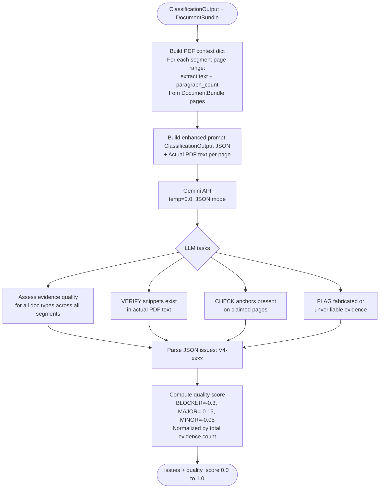

# V4 Evidence Quality Assessor — Code-Verified Process Reference

**File:** `src/agents/v4_evidence_quality.py`
**Class:** `V4EvidenceQualityAssessor`
**Type:** Full LLM — semantic verification against actual PDF source text
**Prompt:** `Prompts/V4_Evidence_Quality_Assessor.txt`
**Purpose:** Independently verify that every evidence snippet and anchor in the `ClassificationOutput` actually exists in the source PDF text, and assess the quality of evidence supporting each classification.

---

## What It Does — Step by Step

### Entry Point
```python
# Lines 32–145
def validate(self, classification: ClassificationOutput, doc_bundle: DocumentBundle) -> Tuple[List[Issue], float]:
```
Returns `(issues, evidence_quality_score)` where score is `0.0–1.0`.

---

### Step 1: Build PDF Context from DocumentBundle
```python
# Lines 52–62
pdf_context = {}
for seg in classification.segments:
    for page_num in range(seg.start_page, seg.end_page + 1):
        if page_num <= len(doc_bundle.pages):
            page_data = doc_bundle.pages[page_num - 1]
            pdf_context[page_num] = {
                "text": page_data['text'],
                "paragraph_count": len(page_data.get('paragraphs', []))
            }
pdf_context_json = json.dumps(pdf_context, indent=2)
```
**What this does:** Extracts the actual text from the `DocumentBundle` for every page that appears in any segment. This is the **ground truth text** from the PDF — used to independently verify the LLM's evidence claims.

> Key design: V4 does NOT trust the classifier's evidence snippets. It independently cross-references them against the raw PDF text extracted by Document AI.

---

### Step 2: Build Enhanced Prompt
```python
# Lines 64–108
full_prompt = f"""{self.prompt_base}

CLASSIFICATION OUTPUT:
{classification_json}

ACTUAL PDF TEXT (for independent verification):
{pdf_context_json}
"""
```
The prompt instructs the LLM to:
1. **Assess evidence quality** — are snippets specific, relevant, and appropriately sized?
2. **VERIFY snippets exist** — does the snippet text actually appear in the PDF text for the claimed page?
3. **CHECK anchors** — are the `anchors_found` strings present on the claimed page?
4. **FLAG fabricated evidence** — any snippet that cannot be found in the source PDF

---

### Step 3: LLM Call
```python
# Lines 110–118
response = self.client.models.generate_content(
    model=settings.gemini_model,
    contents=full_prompt,
    config=GenerateContentConfig(
        temperature=0.0,
        response_mime_type="application/json"
    )
)
```

---

### Step 4: Parse Issues
```python
# Lines 120–133
llm_issues_raw = json.loads(response.text)
for raw in llm_issues_raw:
    issues.append(Issue(
        ig_id=raw.get("ig_id", "IG-3"),
        issue_id=raw.get("issue_id", f"V4-{len(issues):04d}"),
        agent="V4",
        severity=IssueSeverity(raw.get("severity", "MAJOR")),
        ...
    ))
```

### Severity Guidelines (from prompt):
| Condition | Severity |
|---|---|
| Missing/fabricated evidence for PRIMARY classification | BLOCKER |
| Evidence snippet not found in PDF text | BLOCKER |
| Weak evidence, confidence misalignment | MAJOR |
| Anchor not found on claimed page | MAJOR |
| Snippet too long/short, minor quality issues | MINOR |

---

### Step 5: Compute Quality Score — `_compute_quality_score()`
```python
# Lines 147–176
total_evidence = sum(
    len(comp.top_evidence)
    for seg in classification.segments
    for comp in seg.segment_composition
)

penalty = 0.0
for issue in issues:
    if BLOCKER: penalty += 0.3
    elif MAJOR: penalty += 0.15
    else:       penalty += 0.05

return max(0.0, 1.0 - penalty)
```
**Score interpretation:**
- `1.0` — all evidence verified, high quality
- `0.7–0.9` — minor quality issues
- `0.4–0.7` — significant evidence problems
- `< 0.4` — critical evidence failures (fabricated or missing)

If JSON parsing fails, returns `([], 1.0)` — graceful degradation, does not block the pipeline.

---

## Issue Severity Summary

| Condition | Severity | IG Code |
|---|---|---|
| Fabricated evidence for PRIMARY type | BLOCKER | IG-3 |
| Snippet not found in PDF text | BLOCKER | IG-3 |
| Weak/irrelevant evidence | MAJOR | IG-3 |
| Anchor not found on claimed page | MAJOR | IG-3 |
| Confidence misalignment | MAJOR | IG-3 |
| Snippet too long or too short | MINOR | IG-3 |

---

## Mermaid Diagram


