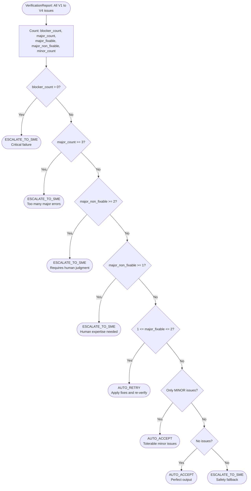

# V5 Arbiter Agent — Code-Verified Process Reference

**File:** `src/agents/v5_arbiter.py`  **Class:** `V5ArbiterAgent`
**Type:** Pure rule-based — no LLM calls, deterministic
**Purpose:** Make the final disposition decision based on consolidated V1–V4 issues.

---

## What It Does — Step by Step

### Step 1: Count Issues by Severity
```python
# Lines 39–54
blocker_count     = len([i for i in issues if i.severity == BLOCKER])
major_count       = len([i for i in issues if i.severity == MAJOR])
minor_count       = len([i for i in issues if i.severity == MINOR])
major_non_fixable = len([i for i in issues if MAJOR and not auto_fixable])
major_fixable     = len([i for i in issues if MAJOR and auto_fixable])
```

---

### Step 2: Apply Decision Rules (first match wins)

| Priority | Condition | Decision | Reason |
|---|---|---|---|
| 1 | `blocker_count > 0` | ESCALATE_TO_SME | Critical failure — structural/fabrication error |
| 2 | `major_count >= 3` | ESCALATE_TO_SME | Too many errors to auto-correct confidently |
| 3 | `major_non_fixable >= 2` | ESCALATE_TO_SME | Requires human judgment |
| 4 | `major_non_fixable >= 1` | ESCALATE_TO_SME | Human expertise needed (conservative) |
| 5 | `1 <= major_fixable <= 2` | AUTO_RETRY | Apply fixes and re-verify |
| 6 | `minor_count > 0, no MAJOR/BLOCKER` | AUTO_ACCEPT | Tolerable minor issues |
| 7 | `total_issues == 0` | AUTO_ACCEPT | Perfect output |
| 8 | Fallback | ESCALATE_TO_SME | Ambiguous — safety default |

---

### Step 3: Return ArbiterDecision
```python
# Lines 66–74  (src/schemas.py Lines 182–191)
ArbiterDecision(
    decision,        # AUTO_ACCEPT | AUTO_RETRY | ESCALATE_TO_SME
    reason,          # human-readable explanation
    issues_analyzed, blocker_count, major_count, minor_count, fixable_count
)
```
Saved to: `output/agent_outputs/{doc_id}/v5_arbiter_decision.json`

---

## Mermaid Diagram


