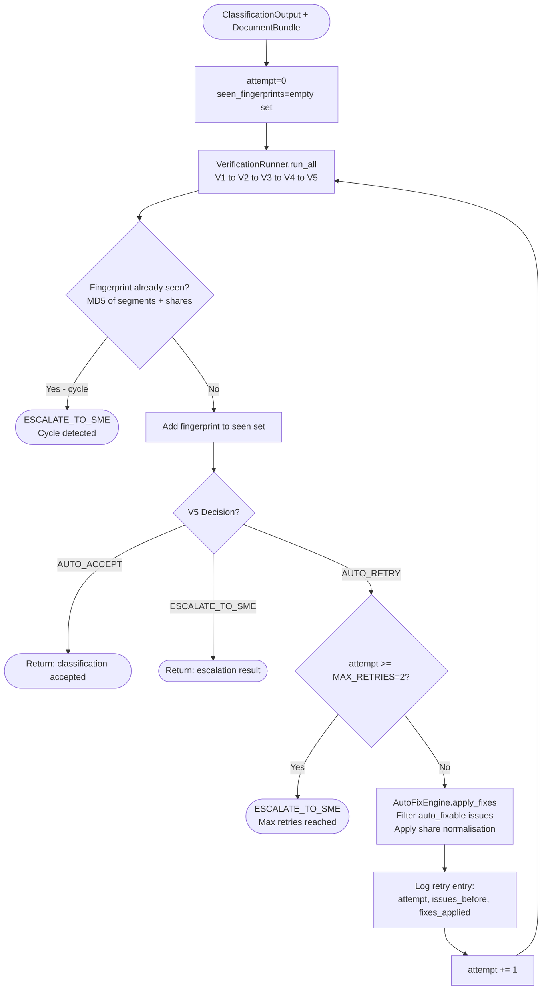

# Retry Orchestrator & Auto-Fix Engine — Code-Verified Process Reference

**Files:** `src/agents/retry_orchestrator.py`, `src/agents/auto_fix_engine.py`
**Classes:** `RetryOrchestrator`, `AutoFixEngine`
**Type:** Rule-based orchestration loop
**Purpose:** Manage the verification retry loop — apply automatic fixes to fixable issues and re-verify, with cycle detection and retry limits.

---

## RetryOrchestrator — What It Does

### Entry Point
```python
# retry_orchestrator.py  Lines 32–133
def verify_with_retry(classification, doc_bundle) -> (final_classification, report, decision, retry_log)
```
`MAX_RETRIES = 2` (so max 3 total verification attempts: attempt 0, 1, 2)

---

### Step 1: Initialise State
```python
current_classification = classification   # may be mutated by fixes
retry_log = []
seen_fingerprints = set()
```

---

### Step 2: Run Verification (Loop)
```python
for attempt in range(MAX_RETRIES + 1):   # 0, 1, 2
    report, decision = verification_runner.run_all(current_classification, doc_bundle)
```
Calls `VerificationRunner.run_all()` which runs V1 → V2 → V3 → V4 → V5 in sequence.

---

### Step 3: Cycle Detection
```python
# Lines 68–80
fingerprint = self._get_classification_fingerprint(current_classification)
if fingerprint in seen_fingerprints:
    → Override decision to ESCALATE_TO_SME
    reason: "Cycle detected in auto-fix loop after {attempt} attempts"
    return immediately
seen_fingerprints.add(fingerprint)
```

**Fingerprint computation** (`Lines 135–169`):
```python
fingerprint_data = {
    'num_segments': classification.number_of_segments,
    'dominant_overall': classification.dominant_type_overall.value,
    'segments': [
        {'start': seg.start_page, 'end': seg.end_page,
         'dominant': seg.dominant_type.value,
         'shares': [round(c.segment_share, 4) for c in seg.segment_composition]}
        for seg in classification.segments
    ],
    'mixture_shares': [round(m.overall_share, 4) for m in classification.document_mixture]
}
return hashlib.md5(json.dumps(fingerprint_data, sort_keys=True).encode()).hexdigest()
```
Detects if a fix produced the exact same classification as a previous attempt (infinite loop prevention).

---

### Step 4: Check Decision
```python
if decision.decision != "AUTO_RETRY":
    return current_classification, report, decision, retry_log  # Done
```
`AUTO_ACCEPT` or `ESCALATE_TO_SME` → exit immediately.

---

### Step 5: Check Max Retries
```python
if attempt >= MAX_RETRIES:
    → Override to ESCALATE_TO_SME
    reason: "Max retries (2) reached. Auto-fix could not resolve all issues."
    return
```

---

### Step 6: Apply Auto-Fixes
```python
fixable_issues = [i for i in report.issues if i.auto_fixable]
current_classification, fixes_applied = self.fix_engine.apply_fixes(current_classification, fixable_issues)
retry_log.append({
    'attempt': attempt + 1,
    'issues_before_fix': len(report.issues),
    'fixable_issues': len(fixable_issues),
    'fixes_applied': fixes_applied,
    'decision_before_retry': decision.decision
})
```
Then loops back to Step 2 with the modified classification.

---

## AutoFixEngine — What It Does

**File:** `src/agents/auto_fix_engine.py`

### Entry Point
```python
# Lines 32–84
def apply_fixes(classification, issues) -> (modified_classification, fixes_log)
```
Works on a **deep copy** of the classification — never mutates the original.

---

### Fix Registry
```python
self.fix_registry = {
    'share_normalization_segment': self._fix_segment_share_normalization,
    'share_normalization_document': self._fix_document_share_normalization,
}
```

---

### Fix Type Inference — `_infer_fix_type()`
```python
# Lines 86–108
message_lower = issue.message.lower()
if 'share' in message_lower and 'sum' in message_lower:
    if 'segment' in message_lower:  → 'share_normalization_segment'
    elif 'mixture' or 'overall':    → 'share_normalization_document'
```

---

### Fix 1: Segment Share Normalisation
```python
# Lines 110–155
current_sum = sum(comp.segment_share for comp in segment.segment_composition)
for comp in segment.segment_composition:
    comp.segment_share = comp.segment_share / current_sum
```
Normalises all 5 `segment_share` values in a segment so they sum to exactly `1.0`.

---

### Fix 2: Document Mixture Share Normalisation
```python
# Lines 157–185
current_sum = sum(mix.overall_share for mix in classification.document_mixture)
for mixture in classification.document_mixture:
    mixture.overall_share = mixture.overall_share / current_sum
```
Normalises all 5 `overall_share` values in `document_mixture` so they sum to exactly `1.0`.

---

## Mermaid Diagram


