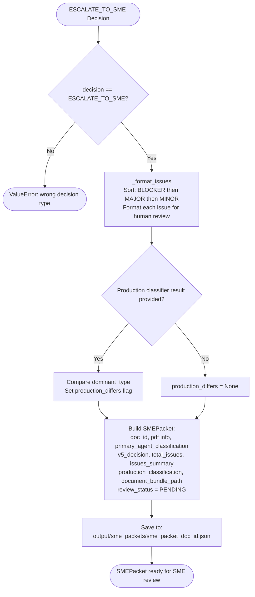

# SME Packet Generation — Code-Verified Process Reference

**File:** `src/evaluation/packet_generator.py`  **Class:** `SMEPacketGenerator`
**Schemas:** `src/evaluation/ground_truth_schemas.py` — `SMEPacket`, `SMEReviewStatus`
**Purpose:** Generate a structured review packet for cases escalated by V5, containing all context an SME needs to make a classification decision.

---

## What It Does — Step by Step

### Entry Point
```python
# Lines 20–91
def generate_packet(pdf_path, primary_classification, verification_report,
                    arbiter_decision, production_result=None, document_bundle_path=None) -> SMEPacket
```

---

### Step 1: Guard — Only for ESCALATE_TO_SME
```python
# Lines 43–47
if arbiter_decision.decision != "ESCALATE_TO_SME":
    raise ValueError(f"Can only generate packets for ESCALATE_TO_SME decisions, got: {arbiter_decision.decision}")
```

---

### Step 2: Format Issues for Human Review — `_format_issues()`
```python
# Lines 93–112
for issue in verification_report.issues:
    formatted_issue = {
        "id": issue.issue_id,           # e.g. "V1-0002"
        "agent": issue.agent,           # "V1", "V2", "V3", "V4"
        "severity": issue.severity.value,  # "BLOCKER", "MAJOR", "MINOR"
        "message": issue.message,
        "location": issue.location or "General",
        "suggested_fix": issue.suggested_fix or "Manual review needed"
    }
# Sorted: BLOCKER (0) → MAJOR (1) → MINOR (2)
severity_order = {"BLOCKER": 0, "MAJOR": 1, "MINOR": 2}
formatted_issues.sort(key=lambda x: severity_order.get(x["severity"], 3))
```

---

### Step 3: Production Classifier Comparison (Optional)
```python
# Lines 58–68
if production_result:
    production_differs = (production_result.dominant_type != primary_classification.dominant_type_overall)
    production_dict = {
        "dominant_type": production_result.dominant_type,
        "all_types": production_result.all_types,
        "vendor": production_result.vendor
    }
```
If a production classifier result is provided, flags whether it disagrees with the primary agent on `dominant_type`.

---

### Step 4: Build SMEPacket
```python
# Lines 74–87  (schema: ground_truth_schemas.py Lines 45–74)
packet = SMEPacket(
    doc_id=doc_id,                                    # PDF filename without extension
    pdf_filename=pdf_file.name,                       # e.g. "doc2_6.pdf"
    pdf_path=str(pdf_file.absolute()),                # absolute path to PDF
    total_pages=len(primary_classification.segments), # segment count used as proxy
    primary_agent_classification=primary_classification,
    v5_decision=arbiter_decision.decision,            # always "ESCALATE_TO_SME"
    total_issues=len(verification_report.issues),
    issues_summary=issues_summary,                    # sorted formatted list
    production_classification=production_dict,        # None if not provided
    production_differs=production_differs,            # None if not provided
    document_bundle_path=document_bundle_path,        # path to DocumentBundle JSON
    review_status=SMEReviewStatus.PENDING
)
```

---

### Step 5: Save Packet — `save_packet()`
```python
# Lines 114–136
output_path = Path("output/sme_packets")
filename = f"sme_packet_{packet.doc_id}.json"
json.dump(packet.model_dump(mode='json'), f, indent=2, default=str)
```
Saved to: `output/sme_packets/sme_packet_{doc_id}.json`

---

## SMEPacket Schema Fields

| Field | Type | Description |
|---|---|---|
| `doc_id` | str | PDF filename without extension |
| `pdf_filename` | str | Original PDF filename |
| `pdf_path` | str | Absolute path to PDF |
| `total_pages` | int | Number of segments (proxy) |
| `primary_agent_classification` | ClassificationOutput | Full primary agent output |
| `v5_decision` | str | Always `ESCALATE_TO_SME` |
| `total_issues` | int | Total issues from V1–V4 |
| `issues_summary` | List[dict] | Sorted formatted issues |
| `production_classification` | dict\|None | Production classifier result |
| `production_differs` | bool\|None | Whether production disagrees |
| `document_bundle_path` | str\|None | Path to DocumentBundle JSON for PDF text |
| `review_status` | SMEReviewStatus | `PENDING` initially |
| `sme_review` | SMEReview\|None | Populated after SME reviews |
| `created_at` | datetime | Packet creation timestamp |

---

## Mermaid Diagram


