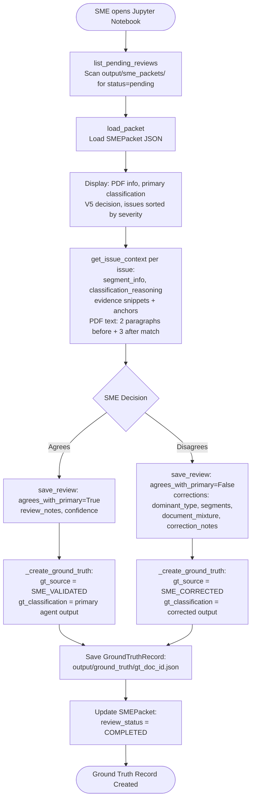

# SME Review & Ground Truth Update — Code-Verified Process Reference

**File:** `src/evaluation/review_helper.py`  **Class:** `SMEReviewHelper`
**Schemas:** `src/evaluation/ground_truth_schemas.py` — `SMEReview`, `SMECorrections`, `GroundTruthRecord`, `GroundTruthSource`
**Purpose:** Provide the Jupyter notebook interface for SME review of escalated cases, and create the final ground truth record.

---

## What It Does — Step by Step

### Initialisation
```python
# Lines 19–33
self.packets_dir = project_root / "output/sme_packets"
self.ground_truth_dir = project_root / "output/ground_truth"
self.ground_truth_dir.mkdir(parents=True, exist_ok=True)
```
Walks up the directory tree from `cwd` until it finds the `src/` directory (project root detection).

---

### Step 1: List Pending Reviews — `list_pending_reviews()`
```python
# Lines 35–53
for packet_file in self.packets_dir.glob("sme_packet_*.json"):
    if data.get('review_status') == 'pending':
        packets.append({'file', 'doc_id', 'total_issues', 'created_at'})
```
Returns a list of all unreviewed SME packets.

---

### Step 2: Load Packet — `load_packet(doc_id)`
```python
# Lines 55–65
packet_file = self.packets_dir / f"sme_packet_{doc_id}.json"
return SMEPacket(**data)
```

---

### Step 3: Get Issue Context — `get_issue_context(packet, issue)`
```python
# Lines 195–377
```
Extracts rich context for each issue to display in the review notebook:

**3a. Parse issue location:**
```python
segment_index = location.get('segment_index')
document_type = location.get('document_type')
```

**3b. Extract segment info:**
```python
context['segment_info'] = {
    'segment_index', 'start_page', 'end_page', 'page_count',
    'dominant_type', 'notes'
}
```

**3c. Extract classification reasoning:**
```python
context['classification_reasoning'] = {
    'document_type', 'presence_level', 'confidence',
    'segment_share', 'reasoning'
}
```

**3d. Extract evidence snippets:**
```python
context['evidence'] = [
    {'page': ev.page, 'snippet': ev.snippet, 'anchors': ev.anchors_found}
    for ev in doc_type_entry.top_evidence
]
```

**3e. Extract actual PDF text from DocumentBundle** (if `document_bundle_path` is set):
```python
# Lines 309–375
for page in bundle_data.get('pages', []):
    if start_page <= page_num <= end_page:
        for ev in context['evidence']:
            if ev['page'] == page_num:
                # Find paragraphs containing the snippet
                for idx, p in enumerate(paragraphs):
                    if snippet.lower() in p.lower():
                        start_idx = max(0, idx - 2)   # 2 paragraphs before
                        end_idx = min(len(paragraphs), idx + 4)  # 3 paragraphs after
                        context_paragraphs = paragraphs[start_idx:end_idx]
```
Returns up to 10 surrounding paragraphs (2 before + match + 3 after) for context.

---

### Step 4: Save Review — `save_review()`
```python
# Lines 67–125
def save_review(doc_id, reviewer_name, agrees_with_primary, corrections=None,
                review_notes="", confidence=1.0)
```

**4a. Build SMECorrections (if disagreeing):**
```python
sme_corrections = SMECorrections(
    corrected_dominant_type=corrections.get('dominant_type'),
    corrected_segments=corrections.get('segments'),
    corrected_document_mixture=corrections.get('document_mixture'),
    correction_notes=corrections.get('notes', '')
)
```

**4b. Build SMEReview:**
```python
sme_review = SMEReview(
    reviewer_name=reviewer_name,
    review_date=datetime.now(),
    agrees_with_primary_agent=agrees_with_primary,
    corrections=sme_corrections,
    review_notes=review_notes,
    confidence_in_review=confidence   # 0.0–1.0
)
```

**4c. Update packet and save:**
```python
packet.sme_review = sme_review
packet.review_status = SMEReviewStatus.COMPLETED
packet.updated_at = datetime.now()
# Overwrites: output/sme_packets/sme_packet_{doc_id}.json
```

**4d. Create ground truth:**
```python
self._create_ground_truth(packet, sme_review)
```

---

### Step 5: Create Ground Truth — `_create_ground_truth()`
```python
# Lines 127–161
if sme_review.agrees_with_primary_agent:
    gt_classification = packet.primary_agent_classification
    gt_source = GroundTruthSource.SME_VALIDATED
else:
    gt_classification = packet.primary_agent_classification  # corrections stored in sme_review
    gt_source = GroundTruthSource.SME_CORRECTED

gt_record = GroundTruthRecord(
    doc_id, pdf_filename, pdf_path,
    production_classification,
    primary_agent_classification,
    v5_decision,
    verification_report={'total_issues', 'issues_summary'},
    sme_review,
    ground_truth_source=gt_source,
    ground_truth_classification=gt_classification
)
# Saved to: output/ground_truth/gt_{doc_id}.json
```

---

## Ground Truth Source Values

| Value | When Set | Meaning |
|---|---|---|
| `PRIMARY_AGENT_AUTO_ACCEPT` | V5 → AUTO_ACCEPT | No SME review needed |
| `SME_VALIDATED` | SME agrees with primary agent | Primary agent was correct |
| `SME_CORRECTED` | SME disagrees and corrects | Primary agent had errors |

---

## GroundTruthRecord Schema

| Field | Description |
|---|---|
| `doc_id` | Document identifier |
| `pdf_filename` / `pdf_path` | PDF reference |
| `production_classification` | Production system's output (for evaluation) |
| `primary_agent_classification` | Primary agent's full output |
| `v5_decision` | The arbiter's decision |
| `verification_report` | Summary of V1–V4 issues |
| `sme_review` | Full SME review including corrections |
| `ground_truth_source` | How GT was established |
| `ground_truth_classification` | The final validated classification |

---

## Mermaid Diagram


