# Agentic Evaluation System — Process Flow Diagrams

---

## 1. End-to-End Pipeline Overview

```mermaid
flowchart TD
    A([📄 Input PDF]) --> B[DocumentProcessor\nGoogle Cloud Document AI]
    B --> C[(DocumentBundle\npages + layout metadata)]
    C --> D[Primary Classifier Agent\nGemini LLM]
    D --> E[(ClassificationOutput\nsegments + evidence + mixture)]
    E & C --> F[RetryOrchestrator]

    F --> G[VerificationRunner\nV1 → V2 → V3 → V4]
    G --> H[V5 Arbiter\nRule-based decision]

    H --> |AUTO_ACCEPT| I([✅ Final Classification\nGround Truth: PRIMARY_AGENT_AUTO_ACCEPT])
    H --> |AUTO_RETRY| J[AutoFixEngine\nApply fixable issues]
    J --> |Re-verify\nmax 2 retries| G
    J --> |Cycle detected\nor max retries| K
    H --> |ESCALATE_TO_SME| K[SMEPacketGenerator]

    K --> L[(SME Packet JSON\noutput/sme_packets/)]
    L --> M[SME Review Interface\nJupyter Notebook]
    M --> |Agrees with primary| N([✅ Ground Truth\nSME_VALIDATED])
    M --> |Corrects classification| O([✅ Ground Truth\nSME_CORRECTED])

    style A fill:#4a90d9,color:#fff
    style I fill:#27ae60,color:#fff
    style N fill:#27ae60,color:#fff
    style O fill:#e67e22,color:#fff
    style K fill:#e74c3c,color:#fff
```



---

## 2. Document Processing (PDF → DocumentBundle)


---

## 3. V1 — Schema & Completeness Validator

> **Type:** Pure rule-based (no LLM). Fast, zero cost.


---

## 4. V2 — Internal Consistency Checker

> **Type:** Hybrid — rule-based pre-filter + LLM semantic validation.

```mermaid
flowchart TD
    IN([ClassificationOutput\n+ DocumentBundle]) --> R1

    subgraph Phase1["Phase 1: Rule-Based Pre-Filter (zero cost)"]
        R1[Check: Segment shares\nsum to 1.0 ±0.01]
        R1 --> |Fails| RE1[MAJOR: V2-xxxx\nShares don't sum to 1.0\nauto_fixable=True]
        R1 --> R2

        R2[Check: Overall mixture\nshares sum to 1.0 ±0.01]
        R2 --> |Fails| RE2[MAJOR: V2-xxxx\nMixture shares wrong\nauto_fixable=True]
        R2 --> R3

        R3[Check: Page ranges\nNo overlaps, start ≤ end]
        R3 --> |Overlap| RE3[BLOCKER: V2-xxxx\nSegment page overlap]
        R3 --> |start > end| RE4[BLOCKER: V2-xxxx\nInverted range]
    end

    RE1 & RE2 & RE3 & RE4 --> BLK{Any BLOCKER\nin rules?}
    BLK --> |Yes| SKIP[Skip LLM\nReturn score=0.0]
    BLK --> |No| LLM

    subgraph Phase2["Phase 2: LLM Semantic Validation"]
        LLM[Build prompt:\nClassificationOutput JSON\n+ Full segment texts from\nDocumentBundle pages]
        LLM --> CALL[Gemini API\ntemp=0.0, JSON mode]
        CALL --> PARSE[Parse JSON array\nof issues]
        PARSE --> LISSUES[LLM Issues:\nV2-LLM-xxxx]
    end

    SKIP & LISSUES --> SCORE[Compute consistency score\nBLOCKER=-0.4, MAJOR=-0.2\nMINOR=-0.05]
    SCORE --> OUT([issues + score 0.0–1.0])

    style IN fill:#4a90d9,color:#fff
    style OUT fill:#8e44ad,color:#fff
    style Phase1 fill:#f0f4ff
    style Phase2 fill:#fff4e6
```



---

## 5. V3 — Trap Detector & Rule Violation Checker

> **Type:** Hybrid — pattern matching + LLM contextual analysis.


---

## 6. V4 — Evidence Quality Assessor

> **Type:** Full LLM — semantic verification against actual PDF text.

```mermaid
flowchart TD
    IN([ClassificationOutput\n+ DocumentBundle]) --> BUILD

    BUILD[Build PDF context dict\nFor each segment's pages:\nextract text + paragraph_count\nfrom DocumentBundle]

    BUILD --> PROMPT[Build enhanced prompt:\nClassificationOutput JSON\n+ Actual PDF text per page]

    PROMPT --> CALL[Gemini API\ntemp=0.0, JSON mode]

    CALL --> TASKS{LLM tasks}
    TASKS --> T1[Assess evidence quality\nfor all doc types / segments]
    TASKS --> T2[VERIFY snippets exist\nin PDF text]
    TASKS --> T3[CHECK anchors present\non claimed pages]
    TASKS --> T4[FLAG fabricated\nor unverifiable evidence]

    T1 & T2 & T3 & T4 --> ISSUES[Parse JSON issues\nV4-xxxx]

    ISSUES --> SCORE[Compute quality score\nBLOCKER=-0.3, MAJOR=-0.15\nMINOR=-0.05\nNormalized by total evidence count]

    SCORE --> OUT([issues + quality_score 0.0–1.0])

    style IN fill:#4a90d9,color:#fff
    style OUT fill:#8e44ad,color:#fff
```



---

## 7. V5 — Arbiter Agent (Final Decision Maker)

> **Type:** Pure rule-based (no LLM). Deterministic decision logic.

```mermaid
flowchart TD
    IN([VerificationReport\nAll V1–V4 issues]) --> COUNT

    COUNT[Count issues by severity:\nblocker_count\nmajor_count / major_fixable / major_non_fixable\nminor_count]

    COUNT --> R1{blocker_count > 0?}
    R1 --> |Yes| ESC1([🔴 ESCALATE_TO_SME\nCritical failure])

    R1 --> |No| R2{major_count ≥ 3?}
    R2 --> |Yes| ESC2([🔴 ESCALATE_TO_SME\nToo many major errors])

    R2 --> |No| R3{major_non_fixable ≥ 2?}
    R3 --> |Yes| ESC3([🔴 ESCALATE_TO_SME\nRequires human judgment])

    R3 --> |No| R4{major_non_fixable ≥ 1?}
    R4 --> |Yes| ESC4([🔴 ESCALATE_TO_SME\nHuman expertise needed])

    R4 --> |No| R5{1 ≤ major_fixable ≤ 2?}
    R5 --> |Yes| RETRY([🟡 AUTO_RETRY\nApply fixes and re-verify])

    R5 --> |No| R6{Only MINOR issues?}
    R6 --> |Yes| ACC1([🟢 AUTO_ACCEPT\nTolerable minor issues])

    R6 --> |No| R7{No issues at all?}
    R7 --> |Yes| ACC2([🟢 AUTO_ACCEPT\nPerfect output])
    R7 --> |No| ESC5([🔴 ESCALATE_TO_SME\nAmbiguous — safety fallback])

    style IN fill:#4a90d9,color:#fff
    style ESC1 fill:#e74c3c,color:#fff
    style ESC2 fill:#e74c3c,color:#fff
    style ESC3 fill:#e74c3c,color:#fff
    style ESC4 fill:#e74c3c,color:#fff
    style ESC5 fill:#e74c3c,color:#fff
    style RETRY fill:#e67e22,color:#fff
    style ACC1 fill:#27ae60,color:#fff
    style ACC2 fill:#27ae60,color:#fff
```



---

## 8. Retry Orchestrator (Auto-Fix Loop)

```mermaid
flowchart TD
    IN([ClassificationOutput\n+ DocumentBundle]) --> INIT[attempt=0\nseen_fingerprints=set]

    INIT --> VER[VerificationRunner.run_all\nV1 → V2 → V3 → V4 → V5]
    VER --> FP{Fingerprint\nalready seen?}

    FP --> |Yes — cycle!| CYC([🔴 ESCALATE_TO_SME\nCycle detected])

    FP --> |No| ADD[Add fingerprint to seen set]
    ADD --> DEC{V5 Decision?}

    DEC --> |AUTO_ACCEPT| DONE([✅ Return final result])
    DEC --> |ESCALATE_TO_SME| DONE2([🔴 Return escalation])

    DEC --> |AUTO_RETRY| MAX{attempt ≥\nMAX_RETRIES=2?}
    MAX --> |Yes| MAXESC([🔴 ESCALATE_TO_SME\nMax retries reached])

    MAX --> |No| FIX[AutoFixEngine.apply_fixes\nFilter auto_fixable issues\nApply share normalization etc.]
    FIX --> LOG[Log retry entry:\nattempt, issues_before,\nfixes_applied]
    LOG --> INC[attempt += 1]
    INC --> VER

    style IN fill:#4a90d9,color:#fff
    style DONE fill:#27ae60,color:#fff
    style DONE2 fill:#e74c3c,color:#fff
    style CYC fill:#e74c3c,color:#fff
    style MAXESC fill:#e74c3c,color:#fff
```



---

## 9. SME Packet Generation

> Triggered only when V5 decides `ESCALATE_TO_SME`.

```mermaid
flowchart TD
    IN([ESCALATE_TO_SME\nDecision]) --> CHK{decision ==\nESCALATE_TO_SME?}
    CHK --> |No| ERR([ValueError: wrong decision])
    CHK --> |Yes| FMT

    FMT[_format_issues\nSort by severity:\nBLOCKER → MAJOR → MINOR\nFormat each issue for human review]

    FMT --> PROD{Production classifier\nresult provided?}
    PROD --> |Yes| DIFF[Compare dominant_type\nSet production_differs flag]
    PROD --> |No| SKIP[production_differs=None]

    DIFF & SKIP --> BUILD

    BUILD[Build SMEPacket:\n• doc_id, pdf_filename, pdf_path\n• primary_agent_classification\n• v5_decision, total_issues\n• issues_summary sorted\n• production_classification\n• document_bundle_path\n• review_status=PENDING]

    BUILD --> SAVE[Save to:\noutput/sme_packets/\nsme_packet_{doc_id}.json]

    SAVE --> OUT([SMEPacket ready\nfor SME review])

    style IN fill:#e74c3c,color:#fff
    style ERR fill:#c0392b,color:#fff
    style OUT fill:#8e44ad,color:#fff
```

---

## 10. SME Review & Ground Truth Update

```mermaid
flowchart TD
    A([SME opens\nJupyter Notebook]) --> B[SMEReviewHelper.list_pending_reviews\nScan output/sme_packets/ for status=pending]
    B --> C[SMEReviewHelper.load_packet\nLoad SMEPacket JSON]

    C --> D[Display in notebook:\n• PDF filename + page count\n• Primary classification\n• V5 decision + issue count\n• Issues sorted by severity]

    D --> E[get_issue_context per issue:\n• segment_info\n• classification_reasoning\n• evidence snippets + anchors\n• PDF text chunks from DocumentBundle\n  2 paragraphs before + 3 after match]

    E --> F{SME Decision}

    F --> |Agrees with\nprimary agent| G[save_review:\nagrees_with_primary=True\nreview_notes, confidence]

    F --> |Disagrees —\ncorrects classification| H[save_review:\nagrees_with_primary=False\ncorrections dict:\n• corrected_dominant_type\n• corrected_segments\n• corrected_document_mixture\n• correction_notes]

    G --> GT1[_create_ground_truth:\ngt_source=SME_VALIDATED\ngt_classification=primary_agent output]

    H --> GT2[_create_ground_truth:\ngt_source=SME_CORRECTED\ngt_classification=corrected output]

    GT1 & GT2 --> SAVE[Save GroundTruthRecord:\noutput/ground_truth/gt_{doc_id}.json\n\nFields:\n• doc_id, pdf info\n• production_classification\n• primary_agent_classification\n• verification_report summary\n• sme_review\n• ground_truth_source\n• ground_truth_classification]

    SAVE --> UPD[Update SMEPacket:\nreview_status=COMPLETED\nupdated_at=now]

    UPD --> DONE([✅ Ground Truth Record Created\nReady for evaluation metrics])

    style A fill:#4a90d9,color:#fff
    style DONE fill:#27ae60,color:#fff
    style GT1 fill:#27ae60,color:#fff
    style GT2 fill:#e67e22,color:#fff
```

---

## 11. Data Flow Summary

| Stage | Input | Output | Stored At |
|---|---|---|---|
| Document Processing | PDF file | `DocumentBundle` | In-memory / optional JSON |
| Primary Classification | `DocumentBundle` | `ClassificationOutput` | `output/classification_result.json` |
| V1 Validation | `ClassificationOutput` + `DocumentBundle` | `List[Issue]` | `output/agent_outputs/{doc_id}/v1_schema_validation.json` |
| V2 Consistency | Same | `List[Issue]` + score | `output/agent_outputs/{doc_id}/v2_consistency_check.json` |
| V3 Trap Detection | Same | `List[Issue]` + trap count | `output/agent_outputs/{doc_id}/v3_trap_detection.json` |
| V4 Evidence Quality | Same | `List[Issue]` + score | `output/agent_outputs/{doc_id}/v4_evidence_quality.json` |
| V5 Arbiter | `VerificationReport` | `ArbiterDecision` | `output/agent_outputs/{doc_id}/arbiter_decision.json` |
| Auto-Fix Engine | `ClassificationOutput` + fixable issues | Fixed `ClassificationOutput` | In-memory (retry loop) |
| SME Packet | Escalated case data | `SMEPacket` | `output/sme_packets/sme_packet_{doc_id}.json` |
| SME Review | `SMEPacket` + reviewer input | `GroundTruthRecord` | `output/ground_truth/gt_{doc_id}.json` |

---

## 12. V5 Decision Outcomes at a Glance

```mermaid
flowchart LR
    V5([V5 Arbiter]) --> A1[🟢 AUTO_ACCEPT\nNo issues or only MINOR\n→ Classification is final GT]
    V5 --> A2[🟡 AUTO_RETRY\n1–2 fixable MAJOR issues\n→ AutoFixEngine + re-verify\nmax 2 attempts]
    V5 --> A3[🔴 ESCALATE_TO_SME\nAny BLOCKER, ≥3 MAJOR,\nor non-fixable MAJOR\n→ SME Packet generated]

    style V5 fill:#2c3e50,color:#fff
    style A1 fill:#27ae60,color:#fff
    style A2 fill:#e67e22,color:#fff
    style A3 fill:#e74c3c,color:#fff
```


